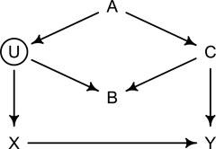
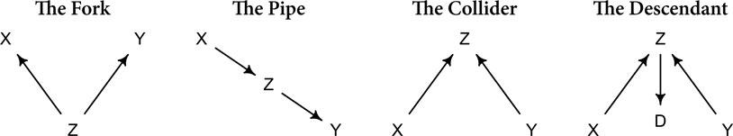
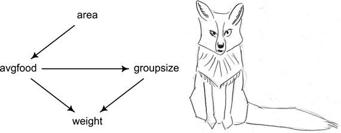
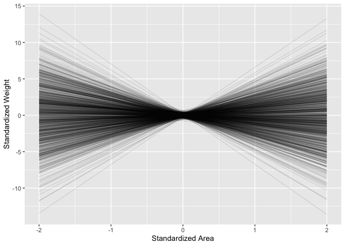

# Activity 11: Statistical reasoning 3: multiple regression and DAGs


Welcome! This is the third statistical reasoning activity. The goals of
this activity are to understand how to implement DAGs in the context of
multiple regression. Specifically, you will:

1.  Build and interpret the relationships in DAGs
2.  Use prior predictive simulation to adjust priors
3.  Apply your undertanding of DAG structure to a multiple regression
    problem

------------------------------------------------------------------------

You will submit one output for this activity:

1.  A **PDF** of a rendered Quarto document with all of your R code.
    Please create a new Quarto document (e.g. don’t use this
    `README.qmd`) and include all of the code that appears in this
    document, your own code, and **answers to all of the questions** in
    the “Q#” sections. Submit this PDF through Gradescope.

A reminder: **Please label the code** in your final submission in two
ways:

1.  denote your answers to each question using headers that correspond
    to the question you’re answering, and
2.  thoroughly “comment” your code: remember, this means annotating your
    code directly by typing descriptions of what each line does after a
    `#`. This will help future you!

------------------------------------------------------------------------

Let’s start by reading in the relevant packages

``` r
library(brms) # for statistics
library(tidyverse) # for data wrangling

# a function to scale and center. from rethinking package
standardize <- function(x) {
    x <- scale(x)
    z <- as.numeric(x)
    attr(z,"scaled:center") <- attr(x,"scaled:center")
    attr(z,"scaled:scale") <- attr(x,"scaled:scale")
    return(z)
}
```

# 1. DAG practice



Directed Acyclic Graphs (DAGs) represent our understanding of causal
influences in a system, with arrows connecting causes to effects.
Consider the DAG above.

Now recreate the DAG above on [dagitty.net](https://dagitty.net). Leave
the window open, as we’ll be using it more.

### Q1.1 Make a DAG

Please paste either your DAG image from the website or the DAG model
code here.

------------------------------------------------------------------------

There are four fundamental relations in a DAG: the fork, the pipe, the
collider, and the descendent. This image shows them:



### Q1.2 Identify forks

Which forks do you see in the DAG you made on dagitty.net? Please write
them out in a Quarto list (look up how to write a list if you don’t
remember!) in the form L ← M → N.

------------------------------------------------------------------------

### Q1.3 Identify colliders

Which colliders do you see? Please write them out in a Quarto list in
the form L → M ← N. Hint: there is more than one!

------------------------------------------------------------------------

### Q1.4 Modify the DAG

Now modify the DAG (it should still be open on dagitty.net) to include
the variable V, an unobserved cause of C and Y: C ← V → Y. Please paste
either your DAG image from the website or the DAG model code here.

------------------------------------------------------------------------

### Q1.5 Identify paths

Reanalyze this new DAG. How many paths connect X to Y? Please list them
in a Quarto list here:

------------------------------------------------------------------------

### Q1.6 Identify open backdoor paths

Which paths must be closed to estimate the direct effect of X on Y? List
the paths

------------------------------------------------------------------------

### Q1.7 Identify variables to close the backdoor(s)

Given what you just wrote about paths to close, which variables should
you condition on to estimate the direct effect of X on Y in your new
DAG?

------------------------------------------------------------------------

# 2. Foxes: Regression practice informed by DAGs


For this section, we are going to implement what we learned about DAGs
into an example about urban fox territories from the `rethinking`
package. Let’s load in the data:

``` r
# Load in the fox data
foxes <- read.csv('https://raw.githubusercontent.com/rmcelreath/rethinking/refs/heads/master/data/foxes.csv', sep = ';')
```

``` r
# Check out the fox data
?foxes
```

    No documentation for 'foxes' in specified packages and libraries:
    you could try '??foxes'

``` r
head(foxes)
```

      group avgfood groupsize area weight
    1     1    0.37         2 1.09   5.02
    2     1    0.37         2 1.09   2.84
    3     2    0.53         2 2.05   5.33
    4     2    0.53         2 2.05   6.07
    5     3    0.49         2 2.12   5.85
    6     3    0.49         2 2.12   3.25

From the Rethinking textbook: “The data in data(foxes) are 116 foxes
from 30 different urban groups in England. These foxes are like street
gangs. `Group size` varies from 2 to 8 individuals. Each group maintains
its own urban territory. Some territories are larger than others. The
`area` variable encodes this information. Some territories also have
more `avgfood` than others. We want to model the `weight` of each fox
\[in kg\].” For the questions below, we will assume the following DAG is
appropriate for this system:



------------------------------------------------------------------------


### Q2.1 Identify the fundamental relations in the fox DAG

Which of the first three fundamental relations above (Fork, Pipe, and
Collider) do you see in the Fox DAG? List the names of the relations you
see AND the particular paths (e.g. “Pipe1: X-\>Z-\>Y, Pipe2: X-\>Z-\>C
and Fork1: X\<-Z-\>Y”)

------------------------------------------------------------------------

## Total causal influence of area on weight

In this first part we are going to infer the total causal influence of
area on weight. Would increasing the area available to each fox make it
heavier (healthier)?

- First, we will standardize the variables.
- Second, we will use prior predictive simulation to check that our
  model’s prior predictions stay within a reasonable outcome range.
- Third, we will run and interpret the models.

Standardize weight to mean zero and standard deviation of 1

``` r
fox_dat <- foxes %>%
  as_tibble() %>%
  select(area, avgfood, weight, groupsize) %>%
  mutate(across(everything(), standardize))
```

Simulate from some priors for a linear regression with intercept *alpha*
and slope *beta*: *alpha* ~ Gaussian(0, 0.2), *beta* ~ Gaussian(0, 2)

``` r
n <- 1000
priorsims <- tibble(group = seq_len(n),
       alpha = rnorm(n, 0, 0.2), # prior for alpha
       beta = rnorm(n, 0, 2)) %>% # prior for beta
  expand(nesting(group, alpha, beta), # the expand function gives us all possible combinations of the arguments
         area = seq(from = -2, to = 2, length.out = 100)) %>% # set up a range of areas
  mutate(weight = alpha + beta * area) # calculate weight from the parameters and area
```

Make a plot of what these priors imply.

``` r
ggplot(priorsims, aes(x = area, y = weight, group = group)) +
  geom_line(alpha = 1 / 10) +
  labs(x = "Standardized Area", y = "Standardized Weight")
```



It’s pretty hard to understand what a “reasonable” fox weight is when it
is in standardized units. Let’s logic our way through this slowly.

------------------------------------------------------------------------

### Q2.2 Minimum fox weight

What to you seems like a reasonable minimum weight for a fox, in kg?

------------------------------------------------------------------------

### Q2.3 Maximum fox weight

What to you seems like a reasonable minimum weight for a fox, in kg?

------------------------------------------------------------------------

### Q2.4 Modify simulation plot

Remake your prior predictive simulation plot and add two horizontal
lines, one each for the minimum and maximum weights that you just
provided. Before plotting, make sure to *standardize* your values in kg
so that they are plotted as centered values in units of standard
deviation (i.e., subtract the mean and divide by the standard deviation
of foxes\$weight).

------------------------------------------------------------------------

### Q2.5 Evaluate prior predictive simulation

Do your priors seem reasonable? You haven’t seen any data yet, though
you have marked out the minimum and maximum weights you expect foxes to
be. Do your priors greatly exceed those values? Please explain your
thinking.

------------------------------------------------------------------------

### Q2.6 Refine priors

Remake and plot a set of prior simulations that use priors you think are
reasonable (adjusting the code from above would work well for this). Be
sure to include the minimum and maximum fox weights that you expect. You
can iterate on this a few times (simulate, plot, adjust, etc.) until you
arrive at priors that make sense to you.

------------------------------------------------------------------------

## Run models

Run a model predicting average food as a function of area. Modify the
code for the priors below to match the priors you just chose.

``` r
food_on_area <- brm(avgfood ~ 1 + area, 
                    data = fox_dat, 
                    family = gaussian,
                    # Here we set the priors that we investigated earlier
                    prior = c(prior(normal(0, 0.2), class = Intercept),
                              prior(normal(0, 2), class = b,),
                              prior(exponential(1), class = sigma)),
                    iter = 4000, warmup = 2000, chains = 4, cores = 4, seed = 1234,
                    file = "output/food_on_area")
```

Check out the summary:

``` r
summary(food_on_area)
```

     Family: gaussian 
      Links: mu = identity 
    Formula: avgfood ~ 1 + area 
       Data: fox_dat (Number of observations: 116) 
      Draws: 4 chains, each with iter = 4000; warmup = 2000; thin = 1;
             total post-warmup draws = 8000

    Regression Coefficients:
              Estimate Est.Error l-95% CI u-95% CI Rhat Bulk_ESS Tail_ESS
    Intercept    -0.00      0.04    -0.09     0.08 1.00     7588     5916
    area          0.88      0.04     0.79     0.97 1.00     7137     5478

    Further Distributional Parameters:
          Estimate Est.Error l-95% CI u-95% CI Rhat Bulk_ESS Tail_ESS
    sigma     0.48      0.03     0.42     0.54 1.00     8061     5859

    Draws were sampled using sampling(NUTS). For each parameter, Bulk_ESS
    and Tail_ESS are effective sample size measures, and Rhat is the potential
    scale reduction factor on split chains (at convergence, Rhat = 1).

We see a fairly strong effect of area on the average amount of food.
Because we standardized each variable by standard deviations, our units
are now in “standard deviations”. (*We can backtransform these value to
translate this back to the normal units! We won’t do that here, as we’ll
get a lot more practice with that when we get to generalized linear
models, but just know that if you are annoyed by the unitless values,
there’s a way out!*)

We find that for an increase of 1 standard deviation in area, we expect
to see a 0.88 standard deviation increase in food. The 95% compatibility
interval for the area parameter is 0.79 to 0.96, which does not include
zero. Logically this makes sense, as a greater area would have more prey
available.

------------------------------------------------------------------------

### Q2.7 Run a model for the impact of food on fox weight

Now infer the total impact of adding food to a territory. Run a model
with `weight` as a function of `avgfood`. Based on your results, does
more food make foxes heavier? In your opinion, is this expected or
unexpected? Please explain in two (2) or more sentences.

------------------------------------------------------------------------

### Q2.8 Is there a variable we should condition upon?

We just estimated the total impact of `avgfood` on `weight`, which
includes both direct and indirect paths. Think back to your DAG
elemental confounds. If we want to estimate only the direct impact of
`avgfood` on `weight`, which variable should we condition upon?

------------------------------------------------------------------------

## Add in `groupsize`

In the previous model we saw no effect of `avgfood` on fox `weight`, but
we have an extra path that we need to account for, since `avgfood` flows
to `weight` through `groupsize`.

First, let’s look at the separate effect of `groupsize` in a univariate
regression, just like with `avgfood`.

------------------------------------------------------------------------

### Q2.9: What’s your hypothesis about how group size affects fox weight?

Before running the model, how do you think the number of foxes in a
group `groupsize` would affect fox weight? Why?

------------------------------------------------------------------------

Now let’s run the model:

``` r
group_on_weight <- brm(weight ~ 1 + groupsize, 
                       data = fox_dat, 
                       family = gaussian,
                       prior = c(prior(normal(0, 0.2), class = Intercept),
                                 prior(normal(0, 0.5), class = b,),
                                 prior(exponential(1), class = sigma)),
                       iter = 4000, warmup = 2000, chains = 4, cores = 4, seed = 1234,
                       file = "output/group_on_weight")
```

``` r
summary(group_on_weight)
```

     Family: gaussian 
      Links: mu = identity 
    Formula: weight ~ 1 + groupsize 
       Data: fox_dat (Number of observations: 116) 
      Draws: 4 chains, each with iter = 4000; warmup = 2000; thin = 1;
             total post-warmup draws = 8000

    Regression Coefficients:
              Estimate Est.Error l-95% CI u-95% CI Rhat Bulk_ESS Tail_ESS
    Intercept    -0.00      0.08    -0.16     0.16 1.00     7636     5822
    groupsize    -0.15      0.09    -0.33     0.02 1.00     7918     5474

    Further Distributional Parameters:
          Estimate Est.Error l-95% CI u-95% CI Rhat Bulk_ESS Tail_ESS
    sigma     1.00      0.07     0.88     1.14 1.00     8166     6280

    Draws were sampled using sampling(NUTS). For each parameter, Bulk_ESS
    and Tail_ESS are effective sample size measures, and Rhat is the potential
    scale reduction factor on split chains (at convergence, Rhat = 1).

Similar to the total effect of `avgfood` on `weight` in a univariate
regression, we see no effect; the estimate for the slope of `groupsize`
on `weight` is -0.16, but the 95% CI are between -0.33 and 0.02, which
includes 0. This suggests the effect of `groupsize` on `weight` could
very well be zero, *given this model*.

To estimate the **direct effect** of `avgfood` on `weight`, we need to
block the indirect path through `groupsize`. To do that, we include
`groupsize` in a multiple regression (along with our main interest,
`avgfood`). (By coincidence, this will also give us the direct effect of
`groupsize` on `weight`. Look hard at the DAG and ask Calvin or Malin if
the reasoning here isn’t clear).

Let’s add in `groupsize` to block the pipe
`weight`-\>`groupsize`-\>`avgfood`:

``` r
food_direct <- brm(weight ~ 1 + avgfood + groupsize, 
                   data = fox_dat,
                   family = gaussian,
                   prior = c(prior(normal(0, 0.2), class = Intercept),
                             prior(normal(0, 0.5), class = b,),
                             prior(exponential(1), class = sigma)),
                   iter = 4000, warmup = 2000, chains = 4, cores = 4, seed = 1234,
                   file = "output/food_direct")

summary(food_direct)
```

------------------------------------------------------------------------

### Interpret the multiple regression output

------------------------------------------------------------------------

#### Q2.10a

What are the effects of `avgfood` and `groupsize` now that you have
accounted for both variables?

------------------------------------------------------------------------

#### Q2.10b

How does this interpretation change your interpretation from the
univariate regressions of each variable separately with `weight`?

------------------------------------------------------------------------

#### Q2.10c

Provide a small discussion (2-4 sentences) explaining in your own words
why these results turned out the way they did, in the context of the
ecological system of fox territories. Include why you think that the
univariate regressions may have suggested no relationship while the
multiple regression suggests a different answer.

------------------------------------------------------------------------

### Render to PDF

When you have finished, remember to pull, stage, commit, and push with
GitHub:

- Pull to check for updates to the remote branch
- Stage your edits (after saving your document!) by checking the
  documents you’d like to push
- Commit your changes with a commit message
- Push your changes to the remote branch

Then submit the well-labeled PDF on Gradescope. Thanks!
